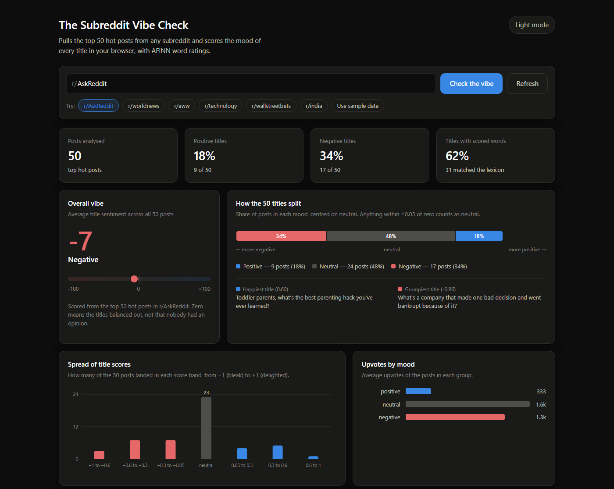

# Reddit Sentiment Analysis


Pick a subreddit, and this reads the mood of its 50 hottest post titles.

**Live:** https://sports-orca-assignment-alpha.vercel.app



That's r/AskReddit when I took the shot. It leans slightly negative, mostly because
questions there tend to ask about the worst or saddest version of something.
[The full page](docs/full.png) keeps going into the word lists and the table of all 50
posts.

## Running it

```bash
npm install
npm run dev
```

Then open http://localhost:5173. Use `npm run dev` rather than opening a build, because the
dev server is what fetches Reddit for you. More on that below.

```bash
npm test
```

33 tests, and nothing extra to install for them - Node has a test runner built in. They
check the scoring rules and the fetching logic. Nothing in the suite touches the network.

## What it does

1. Gets the top 50 hot posts of whatever subreddit you type in.
2. Scores each title using a word list, in your browser.
3. Shows the result: one headline number, the split between moods, the spread of scores,
   which words caused it, and a table of every post.

## How the score works

It uses AFINN, a list of about 3,300 English words with a rating from -5 to +5. `awful` is
-3, `wonderful` is +4. For each title, the ratings of the words it recognises get added up,
then divided by how many words the title has. Dividing matters: without it, a long title
looks angrier than a short one just for having more words in it.

Each title ends up between -1 and +1. Anything within 0.05 of zero counts as neutral. The
big number on the dashboard is the average of all 50, times 100, so it runs from -100 to
+100.

The word list was built from tweets and news, so it doesn't know how people write on
reddit. I added the words I kept seeing that it had no opinion on, like `cringe`,
`wholesome` and `ragebait`. I also had to overrule a few. It reads `sick`, `insane` and
`crazy` as insults, when on reddit they usually mean the opposite. And it rates `no` as
mildly negative, which is fair in "no, that's wrong" but not in a title like "the thing no
one talks about" - that one was making half of r/AskReddit look grumpier than it is.

## Getting the data was the hard part

This took far longer than the dashboard did, so here's what happened.

### The browser isn't allowed to ask Reddit

Fetching `reddit.com/r/pics/hot.json` straight from the page doesn't work. Reddit doesn't
give other websites permission to read its data from a browser, so the browser throws the
response away before my code ever sees it. This is CORS, and no amount of frontend code
gets around it. Something on my own server has to do the fetching instead.

Locally, that's a proxy built into the dev server. The page asks localhost, localhost asks
Reddit, and since the page and the proxy are the same website there's nothing to block.
That worked straight away.

### Then I deployed it and it broke

The dev server proxy only exists while `npm run dev` is running. A deployed site doesn't
have one, so I wrote a small backend function for Vercel to do the same job. Servers don't
have the CORS restriction at all, so that should have been the end of it.

It still failed, with this:

```
Unexpected token '<', "<body clas"... is not valid JSON
```

That's the useful bit. It means my code got HTML where it expected data - so the request
did reach Reddit, and Reddit answered with a "no" page instead of posts. The original
problem was solved and I had a different one: Reddit was refusing my server.

### I stopped guessing

Until then I was changing one thing and redeploying to see what happened, which is slow
and tells you very little. So I made the function report itself. It tries each way of
getting the data in turn, and if they all fail it says what each one said:

```json
{
  "error": "could not reach reddit from the server",
  "tried": [
    "public: Unexpected token '<', \"<body clas\"... is not valid JSON",
    "allorigins: The operation was aborted due to timeout",
    "codetabs: The operation was aborted due to timeout"
  ]
}
```

When it works, the response says which route got the data. After that, checking an idea
took one request instead of a redeploy.

### What I ruled out

- **The User-Agent.** Most advice says Reddit blocks requests that don't identify
  themselves, which is true, so I set the exact format Reddit asks for. Still refused.
  Needed, but not enough on its own.
- **Where the server runs.** Vercel had put my function in Virginia, on Amazon's servers,
  probably the most scraped-from range of addresses there is. I moved it to Mumbai. Still
  refused, so this is about cloud servers generally, not one unlucky location.
- **Free relay services.** Two of them, both timed out. Fine as a last resort, not
  something to hand in.
- **Reddit's official API.** This is the proper answer, and the code for it is written and
  tested. It uses an app token, so it never needs my account password. I couldn't finish
  it: the page for registering an app returns a server error on my account, on both old
  and new Reddit, so I can't get the credentials. It's still the first thing the function
  tries, so it starts working the day that's sorted out.

### What actually worked

I went looking for how other people fetch Reddit from a server - Stack Overflow, Reddit's
own developer subreddits, GitHub. What helped was
[mikefutia/reddit-research-agent](https://github.com/mikefutia/reddit-research-agent), a
tool for turning Reddit threads into research notes. I read its fetching script expecting
some clever trick with headers, and found something simpler: it doesn't ask Reddit at all.
It goes through [ScrapeCreators](https://scrapecreators.com), which fetches Reddit on its
own machines. If somebody else's server makes the request, being blocked isn't my problem.

Their documentation had the endpoint I needed, sorted by hot, and it hands back the same
field names Reddit uses. So my function rearranges its answer into the shape a normal
Reddit response has, and the dashboard can't tell the difference - I didn't have to change
a single file in `src/`. Their pages hold about 25 posts, so it asks for more until it has
50.

### Where it ended up

The function tries these in order and uses the first one that answers properly:

| | Route | Notes |
|---|---|---|
| 1 | Reddit's official API | works as soon as credentials exist |
| 2 | Reddit's public data | free, but blocked from most servers |
| 3 | ScrapeCreators | fetches from its own machines, costs a credit per page |
| 4 | Free relays | free, unreliable, last resort |

Each one gets 4.5 seconds, because the whole function has to finish within 10. If they all
fail, the app loads 50 bundled example posts instead, with a banner saying so, rather than
showing a blank page with an error on it.

Two things I'd do sooner next time. **Read the error properly** - `Unexpected token '<'`
told me the request was arriving and being turned away, which is a different problem from
the one I assumed I had. And **make the thing explain itself before trying to fix it**,
because guessing at code running on someone else's server is slow going.

One small thing worth knowing: a live subreddit doesn't always give exactly 50 posts. One I
tested returned 48. So every count on the dashboard shows the real number rather than
assuming.

## Deploying it

It's a normal Vite app with one backend function, so Vercel needs no setup - import the
repo at [vercel.com/new](https://vercel.com/new) and the defaults are right. Every push to
`main` deploys again.

You need **one** of these, added under Project → Settings → Environment Variables. Then
redeploy, because new variables only apply to new deployments.

| Variable | Where to get it |
|---|---|
| `SCRAPECREATORS_API_KEY` | a key from [scrapecreators.com](https://scrapecreators.com) |
| `REDDIT_CLIENT_ID` | the unlabelled string under the app name at [reddit.com/prefs/apps](https://www.reddit.com/prefs/apps) |
| `REDDIT_CLIENT_SECRET` | the `secret` field on the same app |

If you're registering the Reddit app, choose type **script**. The redirect URL is required
but never used, so `http://localhost:5173` is fine. The name can't contain the word
"reddit" - Reddit rejects those, which is why mine is called `vibe-check-dashboard`.

The ScrapeCreators route costs a credit each time it really fetches, so requests ask for a
day of caching and answers are cached for a minute. Without that, a link a few people open
would eat through a free allowance quickly.

## Choices I made

- **Blue for positive, red for negative**, not the obvious green and red. Green against red
  is the one pair red-green colourblind readers can't tell apart, which is roughly one man
  in twelve.
- **Every number in the charts is in the table too**, so nothing depends on seeing a colour
  or hovering over something.
- **The mood bar is centred on neutral** rather than starting at the left, so you can see
  which way a subreddit leans without reading the numbers.
- **Dark and light mode have their own colours** rather than one being the other flipped
  around.
- **The word lists break ties by how strong a word is**, not alphabetically, so a list of
  words that each appeared once leads with the strongest rather than whatever starts with
  an "a".

## What it can't do

- It only reads **titles**, which is what the assignment asked for. A cheerful title on a
  grim thread still scores as cheerful.
- A word list can't understand sarcasm, or "not great", or context. The "titles with
  scored words" figure shows how many titles it recognised anything in at all. When that's
  low the score means less, and I'd rather show it than quietly hide it.
- Hot listings include pinned moderator posts, which are usually neutral filler.
- Route 3 costs credits and route 4 is often down. Route 1 is the only properly dependable
  one, and it's the one I can't switch on yet.

## Files

```
src/
  App.jsx                 state, search box, loading and errors
  lib/reddit.js           picking a route, fetching, reading the response
  lib/sentiment.js        scoring, the extra words, every number on the dashboard
  lib/sampleData.js       the bundled example posts
  lib/format.js           formatting numbers and dates
  components/             one file per card
api/reddit.js             the backend function the live site uses
test/                     scoring and fetching tests
vercel.json               runs the function in Mumbai
```

## Credits

- [mikefutia/reddit-research-agent](https://github.com/mikefutia/reddit-research-agent) -
  where I found the approach that got the live version working.
- [ScrapeCreators](https://scrapecreators.com) - fetches Reddit from its own machines.
- [`sentiment`](https://www.npmjs.com/package/sentiment) and AFINN - the word ratings.

Built with React and Vite.
